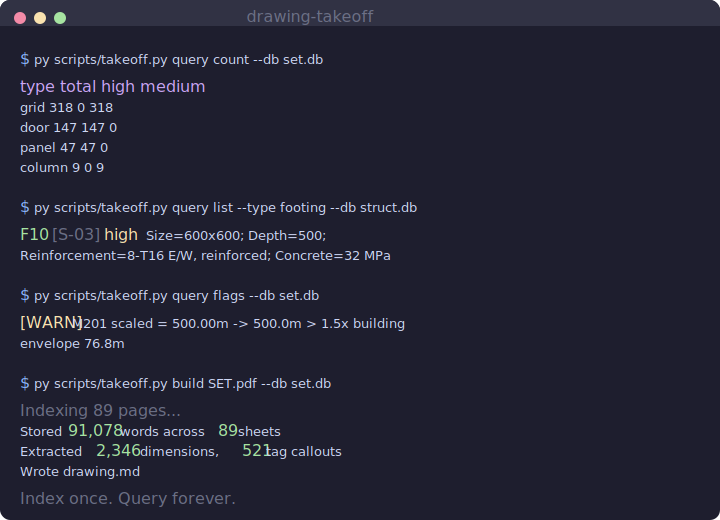
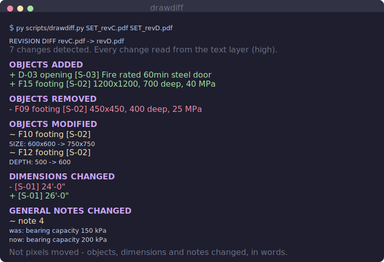

# Drawing Takeoff

**Turn a construction PDF drawing set into a structured, queryable database — then answer takeoff questions from the database instead of making an LLM re-read the drawings every time.**

Contractors get flattened PDF drawings, not the BIM model. But a construction PDF still carries a hidden **vector text layer** with the real tags, schedules, and dimensions. This tool reads that layer once, builds a SQLite database, and answers questions from the database. Counting objects becomes exact (it's reading text, not guessing from pixels), every number is tagged with a confidence level, and measurements are sanity-checked against the building envelope.

It ships as a [Claude Code](https://docs.claude.com/en/docs/claude-code) skill, but the engine is a plain Python CLI you can run on its own.

---

## Why

Feeding raw drawings to a model is the expensive, unreliable path — it guesses from pixels and mis-weights detail buried in a huge context. Reading the vector text is cheaper and accurate. Querying a finished database is cheapest of all and deterministic:

| Approach | What the model reads | Relative cost |
|---|---|---|
| Raw drawing images | pixels | highest |
| Text + markdown | extracted text | lower |
| **This tool** | a structured query result | **lowest — a query answer is a few hundred bytes, not a 49 MB PDF** |

Index once. Build the database. Query it forever.

---

## Install

Requires **Python 3.10+** and one library:

```bash
pip install -r requirements.txt      # just PyMuPDF
```

On Windows use the `py` launcher; on macOS/Linux use `python3`.

### As a Claude Code skill (optional)

Copy the repo into your skills directory so Claude uses it automatically:

```
~/.claude/skills/drawing-takeoff/            (global)
<project>/.claude/skills/drawing-takeoff/    (per project)
```

Then ask *"how many doors in this set?"* and it builds/queries the database instead of reading the PDF.

---

## Quickstart

```bash
# 1. Index the PDF once (fast). Also writes drawing.md, a one-page set index.
py scripts/takeoff.py build SET.pdf --db set.db

# 2. Add high-confidence counts from schedule sheets (opt-in; table detection
#    is slow on large sheets, so point it only at the schedule pages).
py scripts/takeoff.py schedules SET.pdf --db set.db --auto

# 3. Query the database — cheap, instant, repeatable.
py scripts/takeoff.py query count                 # totals by object type
py scripts/takeoff.py query list  --type door     # each object + attributes + sheet
py scripts/takeoff.py query dims  --sheet A101    # dimensions on a sheet
py scripts/takeoff.py query flags                 # measurements that failed sanity
py scripts/takeoff.py query sql "SELECT ..."      # any read-only SQL
```

---

## Example output

<p align="center">
  
</p>

Real output from an 89-page architectural set (`example/`), and from a structural footing schedule:

```
$ py scripts/takeoff.py query count --db set.db
type          total   high medium
grid            318      0    318
door            147    147      0
panel            47     47      0
column            9      0      9

$ py scripts/takeoff.py query list --type door --db set.db
door 110:  3'-0" x 7'-10 1/2", hollow metal, 45 MIN fire.  source: sheet A601.
door 130:  3'-0" x 7'-10 1/2", wood.                       source: sheet A601.

$ py scripts/takeoff.py query list --type footing --db struct.db
F10   [S-03]  high   Size=600x600; Depth=500; Reinforcement=8-T16 E/W, reinforced; Concrete=32 MPa
```

Each entry is read from the schedule's text layer — every field is verifiable, not estimated.

---

## The reliability rule

Not every question is equally trustworthy, and the tool never pretends otherwise.

| Source | Confidence | Why |
|---|---|---|
| Schedule row | **high** | a literal row in a titled schedule table |
| Printed dimension (`218'-1/4"`) | **high** | reading a number the designer wrote |
| Tag callout on a plan | **medium** | pattern match; depends on the labelling convention |
| Distance scaled from pixels | **low** | a visual estimate; must pass a sanity check |

Every measurement is tagged `confidence` and `sanity_status`. The tool establishes the building envelope from the high-confidence printed dimensions, then flags any measurement that exceeds it — so a mis-scaled duct run gets caught instead of silently trusted:

```
$ py scripts/takeoff.py query flags --db set.db
[WARN] M201 scaled = 500.00m  ->  500.0m > 1.5x building envelope 76.8m
```

---

## `drawing.md` — the one-page index

`build` and `schedules` auto-generate `drawing.md`: a short summary of the whole set — object totals and, per sheet, the discipline, scale, and what's on it (e.g. `A601 | 147 door, 330 dims`). Read it first on any question so you go straight to the right sheet. See `example/drawing.md`.

---

## Revision diff — what actually changed between two issues

Drawings get reissued constantly (Rev C, Rev D, …), and someone has to work out what changed — a moved wall or a resized footing that isn't caught costs real money on site. Pixel-overlay tools (Bluebeam Compare, web diff sites) show you *where pixels changed*; they can't say *what* changed in words, and they light up the whole sheet if the title block shifts. `drawdiff.py` reads the **text layer** of both revisions and reports change at the level a takeoff cares about:

```bash
py scripts/drawdiff.py SET_revC.pdf SET_revD.pdf
```

<p align="center">
  
</p>

- **Objects added / removed / modified** — schedule rows keyed by mark, down to the attribute (`F10 SIZE: 600x600 -> 750x750`).
- **Dimensions changed** — printed dimensions that differ, per sheet.
- **Notes changed** — general notes whose text was revised.

It doesn't need grid-ruled tables (many real schedules have none): rows are recovered by clustering words on their y-position, columns by x-position. Every change is tagged `high` confidence because it's read text, not a pixel guess. See [`example/revisions/`](example/revisions/) for a runnable before/after fixture with a known answer key (all 7 changes detected).

---

## Commands

| Command | Does |
|---|---|
| `build PDF --db set.db` | index the PDF: sheets, scales, dimensions, tag counts; writes `drawing.md` |
| `schedules PDF --db set.db [--auto \| --pages 12,56]` | opt-in high-confidence schedule counts with attributes |
| `summary --db set.db` | regenerate `drawing.md` |
| `check --db set.db` | re-run sanity cross-checks |
| `query count [--type X]` | object totals, by confidence |
| `query list --type X` | each object with its attributes and source sheet |
| `query sheets` | sheet index (number, discipline, scale) |
| `query dims [--sheet A101]` | dimensions, largest first |
| `query flags` | measurements that failed the sanity check |
| `query sql "SELECT ..."` | any read-only SQL against the database |

---

## Tuning per drawing set

Tagging conventions differ between offices. Everything drawing-specific lives in [`scripts/patterns.py`](scripts/patterns.py):

- `TAG_PATTERNS` — how doors/windows/columns/grids are labelled on plans. **Edit these first** if plan counts look wrong.
- `SCHEDULE_KEYWORDS` — title words that identify a schedule and its object type (doors, footings, panels, fixtures, …).
- `DISCIPLINE_MAP`, scale patterns — sheet-number and scale conventions.
- `MAX_PLAUSIBLE_FEET` — ceiling for a single dimension before it's treated as a glued reference number.

Schedule row-counts and printed dimensions are reliable across sets. Tag-based plan counts depend on the regexes matching your set — spot-check them against one sheet before trusting them on a bid.

---

## Known limits

- **Scanned / image-only PDFs have no vector text.** This workflow needs the text layer. If `build` reports ~0 words stored, the set was scanned and needs OCR first.
- **Tag counts are only as good as the regexes.** Verify against one sheet.
- **Pages with several different schedules** are typed by priority and labelled `mixed_schedule` — treat those counts as needing a human glance.
- **Pixel-measuring of unlabelled distances is deliberately not automated.** The tool extracts printed dimensions (reliable) rather than guessing lengths off the scale bar.

---

## How it works

1. **Extract** — PyMuPDF reads the vector text (word + bounding box) from every sheet. Sheet number, discipline, and scale come from the title block and scale note.
2. **Dimensions** — feet/inch tokens are paired spatially (`12'` next to `1/2"`) into real dimensions, tagged high confidence.
3. **Schedules** — on schedule sheets, tables are detected and every data row becomes one high-confidence object, with its columns captured as attributes. (One schedule split across table fragments is re-joined by matching column counts to the header.)
4. **Sanity** — the building envelope is derived from the printed dimensions; measurements beyond it are flagged.
5. **Query** — everything lands in SQLite. Questions are answered from the database; the PDF is only reopened to double-check a visual detail.

---

## License

MIT — see [LICENSE](LICENSE).
